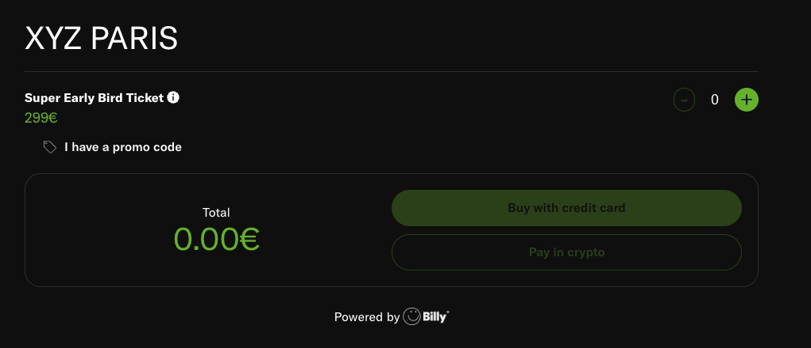
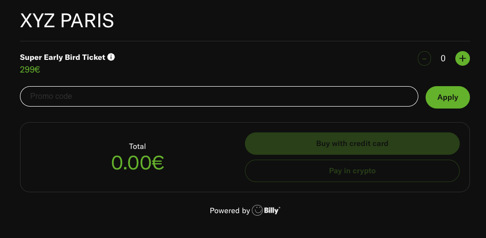
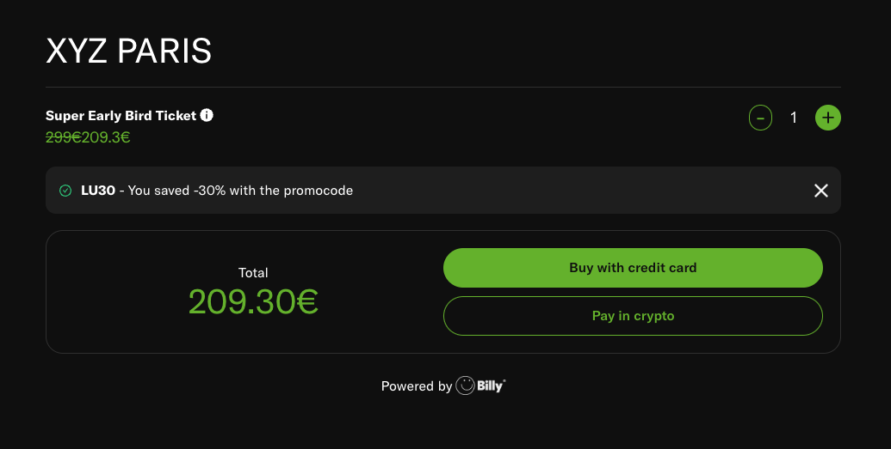

# Technical Interview for frontend developer

The goal of this exercise is to develop the "Promo code" feature on the tickets checkout page. This feature allows the
user to apply a reduction code on 1 or many ticket categories and get reductions on the final price.

Here are the sketches of the expected final output:





## How to run the project on your local machine

```bash
npm run dev
# or
yarn dev
# or
pnpm dev
# or
bun dev
```

Open [http://localhost:3000](http://localhost:3000) with your browser to see the result.

You can start editing the page by modifying `app/page.tsx`. The page auto-updates as you edit the file.

This project uses [`next/font`](https://nextjs.org/docs/basic-features/font-optimization) to automatically optimize and
load Inter, a custom Google Font.
